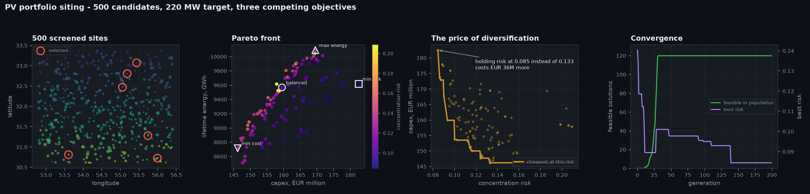
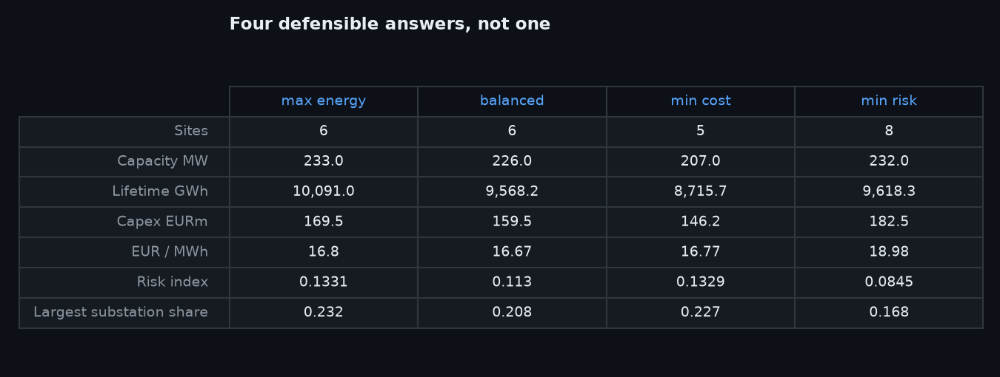

# PV Portfolio Site Selection

Choosing which solar sites to build, out of 500 screened candidates, when energy,
cost and risk pull in different directions.



## The problem

A developer runs a pre-study, screens a region and ends up with roughly 500
candidate points, each with irradiation, terrain, land price and distances to the
grid and the road network. They now need a 220 MW portfolio and a budget of
EUR 190M.

Ranking sites by one number does not work, because the criteria disagree with each
other by construction:

- The best-irradiated land is in the south, far from substations.
- The cheapest land is far from roads, so access costs more to build.
- Substations sit near towns, where land is most expensive.

So there is no single best site, and no single best portfolio.

## Three objectives

| Objective | Direction | Why it is there |
|---|---|---|
| 25-year energy yield | maximise | the revenue line |
| Total capital cost | minimise | EPC, land, grid connection, access road, earthworks |
| Concentration risk | minimise | Herfindahl index over substations, plus geographic clustering |

The third one is the interesting one, and it is usually the one left out. A
portfolio that puts 220 MW behind a single substation is cheaper *and* sunnier —
and one transformer failure removes all of it. Without that objective the optimiser
will happily recommend exactly that, and a lender will reject it.

Constraints: capacity within ±6% of target, capital budget, spare capacity at each
substation, no more than 30% of capacity behind any one substation, and a minimum
12 km separation between selected sites.

## The result

120 feasible, non-dominated portfolios. Four are worth putting in front of a board:

| | max energy | balanced | min cost | min risk |
|---|---|---|---|---|
| Sites | 6 | 6 | 5 | 8 |
| Capacity MW | 233 | 226 | 207 | 232 |
| Lifetime GWh | 10,091 | 9,568 | 8,716 | 9,618 |
| Capex EURm | 169.5 | 159.5 | 146.2 | 182.5 |
| EUR/MWh | 16.80 | 16.67 | 16.77 | 18.98 |
| Risk index | 0.133 | 0.113 | 0.133 | 0.085 |
| Largest substation share | 23.2% | 20.8% | 22.7% | 16.8% |

The number that matters is in the third panel of the figure above: **holding
concentration risk at 0.085 instead of 0.133 costs EUR 36M**. That is a sentence a
board can actually decide on. "The optimiser recommends portfolio 47" is not.



## The algorithm

NSGA-II (Deb et al., 2002) over a binary selection vector, written out in numpy
rather than imported, for two reasons: the demonstrator then runs with no solver
dependency, and the constraint handling needed to be problem-specific.

- **Constrained domination.** A feasible solution always dominates an infeasible
  one; between two infeasible ones, the smaller total violation wins. This lets the
  population migrate into the feasible region rather than being culled.
- **Repair operator.** A random binary vector over 500 sites is essentially never
  within ±6% of a capacity target, so children are repaired by adding or dropping
  sites until they land in the band. Without this the search spends every
  generation on infeasible ground.
- **Crowding distance** keeps the front spread rather than bunched at one end.

Convergence, from the fourth panel: 0 feasible at generation 0, the whole population
feasible by generation 40, and the risk objective still improving until roughly
generation 140.

## Running it

```bash
pip install -r requirements.txt

# screen candidates and optimise in one go
PYTHONPATH=src python -m pvsite.cli demo --n 500 --target-mw 220 --budget-meur 190

# or separately
PYTHONPATH=src python -m pvsite.cli screen --n 500 --out outputs
PYTHONPATH=src python -m pvsite.cli optimise --sites outputs/candidates.csv \
    --target-mw 220 --pop 120 --generations 220

# figures
PYTHONPATH=src python examples/make_figures.py

# tests
PYTHONPATH=src python tests/test_pvsite.py
```

`optimise` takes any CSV with the candidate columns, so a real pre-study drops
straight in.

## What is real and what is synthetic

**Real:** the engineering and cost basis. Performance ratio of 87% and the
irradiation range come from the 10 MW Nir PV plant in Yazd province, whose project
profile and financial model I authored as R&D expert at Kish Solar Trading Co.
Degradation, EPC cost per kW, grid connection cost per km-MW and the 1.6 ha/MWp
footprint are industry-standard figures, all stated as named constants at the top
of `model.py` so they can be argued with rather than hunted for.

**Synthetic:** the 500 candidate sites. These are generated, not surveyed — but
generated with the correlations real geography has, which is what makes the problem
non-trivial. Irradiation rises to the south and with altitude; land is cheap where
it is far from a road; substations cluster where land is dear. Remove those
correlations and the three objectives stop conflicting, and the whole exercise
becomes pointless.

## Layout

```
src/pvsite/
  candidates.py   region model and candidate generation
  model.py        economics, objectives, constraints
  nsga2.py        NSGA-II with constrained domination and repair
  plots.py        figures, dark and light
  cli.py          screen / optimise / demo
tests/            20 tests, deterministic, no network
examples/         figure regeneration
```

Dependencies: numpy, pandas, matplotlib.

## Licence

MIT.
